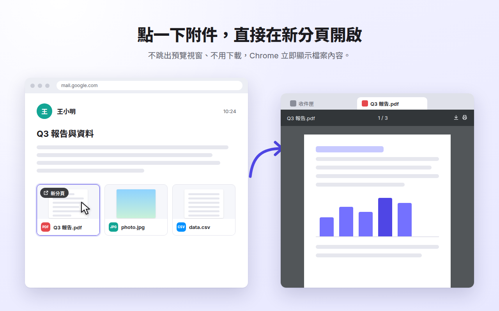

# Tabachment

在 Gmail 點一下附件，就直接在**新分頁**開啟：PDF、圖片、文字檔、影片與音訊由 Chrome 直接顯示，不跳出 Gmail 的預覽視窗，也不用先下載。

[English below](#english)



## 功能

- **點擊附件 → 新分頁顯示**：PDF 使用 Chrome 內建的 PDF 檢視器（可縮放、搜尋、列印、儲存）。
- **支援格式**：PDF；圖片（PNG、JPG、GIF、WebP、BMP、ICO、AVIF）；文字檔（TXT、CSV、JSON、Markdown、XML、記錄檔、程式碼）；影片（MP4、WebM、MOV、OGV）；音訊（MP3、M4A、WAV、OGG、FLAC、AAC）。
- **中文文字檔不亂碼**：保留郵件宣告的編碼；UTF-8 與 Big5（例如 Excel 匯出的 CSV）都能正確顯示。
- **撰寫郵件時的附件**：已上傳的附件也能點擊在新分頁開啟。
- **其他檔案不受影響**：Word、Excel、PowerPoint、ZIP、HTML 等維持 Gmail 原本的預覽。
- **快捷操作**：Ctrl／⌘＋點擊或中鍵點擊在背景分頁開啟；Alt／Option＋點擊使用 Gmail 原本的預覽。
- **「新分頁」按鈕**：滑鼠移到附件上時出現。
- **可調整**：點工具列上的 Tabachment 圖示開啟設定，可選擇檔案類型、背景開啟、是否顯示按鈕。
- **介面語言**：繁體中文、簡體中文、英文、日文。
- **重視隱私**：完全在瀏覽器中運作，不收集任何資料。詳見 [隱私權政策](PRIVACY.md)。

## 安裝

### 從 Chrome 線上應用程式商店

上架完成後即可一鍵安裝。上架步驟請見 [store/PUBLISHING.md](store/PUBLISHING.md)。

### 開發人員模式（自行安裝）

1. 下載或 clone 這個專案。
2. 在 Chrome 開啟 `chrome://extensions`，開啟右上角的「開發人員模式」。
3. 點「載入未封裝項目」，選擇專案中的 `extension` 資料夾。
4. 打開 Gmail，點一下 PDF 附件試試看。

需要 Chrome 128 以上版本（Edge、Brave 等 Chromium 瀏覽器亦可）。

## 運作原理

1. **內容腳本**（`extension/src/content/gmail.js`）在 Gmail 頁面上辨識附件卡片與撰寫視窗中的附件連結，在 Gmail 自己的程式之前攔截點擊（capture 階段），只處理瀏覽器能直接顯示的格式。
2. **Service worker**（`extension/src/background/service-worker.js`）開啟新分頁，先為**這個分頁**加上 `declarativeNetRequest` 工作階段規則，再讓分頁前往 Gmail 的附件網址。
3. Gmail 原本以 `Content-Disposition: attachment` 回應，使 Chrome 下載檔案；規則把它改為 `inline`，Chrome 便在分頁中顯示檔案。規則**只在回應是被動格式時生效**（PDF、點陣圖片、影音、純文字），HTML、SVG 等可能執行程式的內容一律維持下載，不會被顯示。分頁關閉時規則即被移除。
4. 以 `application/octet-stream` 寄出的檔案會依副檔名修正為正確的類型；未宣告編碼的 UTF-8 文字由 `text-fix.js` 修正亂碼。

## 已知限制

- 依賴 Gmail 的網頁結構（附件卡片 `span.aZo` 與其 `download_url` 屬性），Gmail 大幅改版時可能需要更新。
- 若 Chrome 設定為「下載 PDF 檔案」，PDF 仍會被下載：請到「設定 › 隱私權和安全性 › 網站設定 › 其他內容設定 › PDF 文件」選擇「在 Chrome 中開啟 PDF 檔案」。
- 存放在 Google 雲端硬碟的大型附件，維持 Gmail／雲端硬碟原本的開啟方式。
- HEIC、TIFF 等 Chrome 無法顯示的圖片格式，維持 Gmail 的預覽。

## 開發

需要 Node.js 22 以上。

```bash
npm install                        # 安裝開發工具（Playwright、字型）
npm test                           # 單元測試
npx playwright install chromium    # 第一次執行端對端測試前
npm run test:e2e                   # 端對端測試（HEADED=1 可看到瀏覽器）
npm run build                      # 產生 dist/tabachment-<版本>.zip
npm run assets                     # 重新產生圖示與商店圖片
```

端對端測試會在 Chromium 載入擴充功能，並用 `--host-resolver-rules` 把 `mail.google.com` 與 `mail-attachment.googleusercontent.com` 導向本機的模擬 Gmail（HTTPS，需要 `openssl` 產生測試憑證）。模擬伺服器和真正的 Gmail 一樣以 `Content-Disposition: attachment` 提供附件，並含有模擬 Gmail 預覽的點擊處理程式，用來確認：檔案在新分頁顯示而非下載、Gmail 的預覽不會被觸發、偽裝成 PDF 的 HTML 不會被顯示、規則只作用於該分頁等。

### 專案結構

```text
extension/                 上傳到商店的擴充功能本體
  manifest.json
  _locales/                en、zh_TW、zh_CN、ja
  icons/
  src/
    shared/attachments.js  共用邏輯：辨識附件、判斷格式、產生規則
    content/               Gmail 內容腳本、按鈕樣式、文字亂碼修正
    background/            service worker
    pages/                 設定頁、開啟中的過渡頁
test/
  unit/                    node:test 單元測試
  e2e/                     Playwright 端對端測試與模擬 Gmail
scripts/                   build.mjs（打包 ZIP）、render-assets.mjs（產生圖片）
store/                     上架指南、商店說明、隱私權分頁答案、圖片
PRIVACY.md                 隱私權政策
```

---

## English

**Tabachment** is a Chrome extension: click a PDF, image, text, video or audio attachment in Gmail and it opens right away in a new tab, displayed by Chrome itself, instead of Gmail's preview overlay or a download. Other formats keep Gmail's behavior; Alt-click (Option-click) also keeps it, and Ctrl/⌘-click or middle-click opens a background tab.

How it works: a content script intercepts clicks on Gmail attachment cards and compose attachment links; the service worker opens a tab, adds `declarativeNetRequest` session rules scoped to that tab, then loads Gmail's attachment URL. The rules turn `Content-Disposition: attachment` into `inline` only for passive formats (PDF, raster images, audio, video, plain text) and relabel `application/octet-stream` files by extension; HTML and other active content is never rendered. Rules are removed when the tab closes.

- Install for development: `chrome://extensions` › Developer mode › **Load unpacked** › select the `extension` folder (Chrome 128+).
- Tests: `npm test` (unit), `npm run test:e2e` (loads the extension in Chromium against a fake Gmail served over HTTPS).
- Package for the Chrome Web Store: `npm run build` → `dist/tabachment-<version>.zip`. See [store/PUBLISHING.md](store/PUBLISHING.md) (Traditional Chinese), [store/listing.md](store/listing.md) and [store/privacy-practices.md](store/privacy-practices.md).
- Privacy: no data collection at all. See [PRIVACY.md](PRIVACY.md).

Gmail is a trademark of Google LLC. Tabachment is not affiliated with or endorsed by Google.
